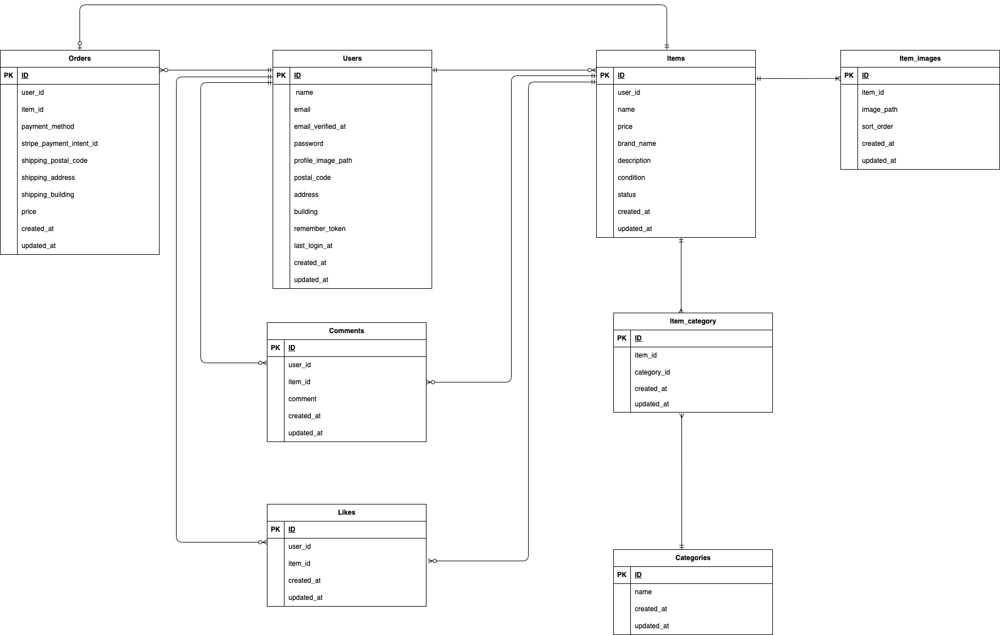

# 📘 coachtechフリマ – フリマアプリケーション

**coachtechフリマ** は、ユーザーが商品を出品・購入できるフリマアプリケーションです。  
会員登録・ログイン・商品出品・いいね・コメント・購入など  
フリマサービスの基礎となる機能を実装しています。

---

## 📝 アプリの機能概要

本アプリケーションでは、以下の機能を提供します。

- 会員登録・ログイン・ログアウト
- ユーザープロフィール編集
- 商品一覧表示
- 商品詳細表示
- 商品出品（画像アップロード対応）
- 商品編集・削除
- いいね（お気に入り登録）
- コメント投稿
- 商品購入（購入処理）
- マイページ（出品商品・購入商品一覧）
- キーワード検索
- カテゴリ・状態による絞り込み

---

## 🗂 画面設計（URL 設計）

| 画面名称                         | パス                        | HTTP メソッド | 備考                       |
| -------------------------------- | --------------------------- | ------------- | -------------------------- |
| 商品一覧画面（トップ画面）       | /                           | GET           | トップページ               |
| 商品一覧画面（マイリスト）       | /?tab=mylist                | GET           | ログイン必須               |
| 会員登録画面                     | /register                   | GET / POST    | 登録フォーム・処理         |
| ログイン画面                     | /login                      | GET / POST    | ログインフォーム・処理     |
| ログアウト                       | /logout                     | POST          | ログアウト処理             |
| 商品詳細画面                     | /item/{item_id}             | GET           | 詳細表示                   |
| 商品購入画面                     | /purchase/{item_id}         | GET / POST    | 購入フォーム・処理         |
| 住所変更ページ                   | /purchase/address/{item_id} | GET / POST    | 配送先住所の変更           |
| 商品出品画面                     | /sell                       | GET / POST    | 出品フォーム・処理         |
| プロフィール画面                 | /mypage                     | GET           | プロフィール・出品商品表示 |
| プロフィール画面（購入した商品） | /mypage?page=buy            | GET           | 購入済み商品一覧           |
| プロフィール画面（出品した商品） | /mypage?page=sell           | GET           | 出品済み商品一覧           |
| プロフィール編集画面             | /mypage/profile             | GET / POST    | プロフィール編集フォーム   |

---

## 🧩 機能要件

### 👤 会員登録・認証

- メールアドレス・パスワードで登録
- ログイン / ログアウト
- ゲストユーザーは閲覧のみ可能

### 🛍 商品一覧

- 全商品を一覧表示（画像・商品名・いいね数・価格）
- 販売済み商品には SOLD バッジを表示
- 「おすすめ」「マイリスト」タブ切り替え

### 🔍 商品検索

- キーワードによる部分一致検索
- カテゴリ・商品状態による絞り込み

### 📄 商品詳細

- 商品画像・名称・ブランド・価格・説明
- カテゴリ・商品状態
- いいね数・コメント数
- 出品者情報
- いいねボタン・コメント投稿フォーム

### ❤️ いいね機能

- ログイン済みユーザーのみ利用可能
- 同一商品に対して 1 ユーザー 1 いいね
- 再クリックで解除

### 💬 コメント機能

- ログイン済みユーザーのみ投稿可能
- 255 文字以内

### 🛒 商品購入

- 購入確認画面あり
- 支払い方法・配送先住所の選択
- 購入後は SOLD 表示

### 📦 商品出品

- 画像アップロード（1 枚）
- カテゴリ・状態・価格・説明を入力
- バリデーションあり（FormRequest）

### 👤 マイページ

- 出品商品一覧
- 購入商品一覧
- プロフィール画像・住所の編集

---

## ⚠ バリデーション仕様

**FormRequest を使用**

### RegisterRequest.php（会員登録）

| フォーム項目     | ルール                                         |
| ---------------- | ---------------------------------------------- |
| ユーザー名       | 入力必須・20 文字以内                          |
| メールアドレス   | 入力必須・メール形式                           |
| パスワード       | 入力必須・8 文字以上                           |
| 確認用パスワード | 入力必須・8 文字以上・パスワードと一致すること |

### LoginRequest.php（ログイン）

| フォーム項目   | ルール               |
| -------------- | -------------------- |
| メールアドレス | 入力必須・メール形式 |
| パスワード     | 入力必須             |

### CommentRequest.php（コメント投稿）

| フォーム項目 | ルール                 |
| ------------ | ---------------------- |
| 商品コメント | 入力必須・255 文字以内 |

### PurchaseRequest.php（商品購入）

| フォーム項目 | ルール   |
| ------------ | -------- |
| 支払い方法   | 選択必須 |
| 配送先       | 入力必須 |

### AddressRequest.php（住所変更）

| フォーム項目 | ルール                        |
| ------------ | ----------------------------- |
| 郵便番号     | 入力必須・ハイフンありの8文字 |
| 住所         | 入力必須                      |

### ProfileRequest.php（プロフィール編集）

| フォーム項目     | ルール                        |
| ---------------- | ----------------------------- |
| プロフィール画像 | 拡張子が .jpeg または .png    |
| ユーザー名       | 入力必須・20 文字以内         |
| 郵便番号         | 入力必須・ハイフンありの8文字 |
| 住所             | 入力必須                      |

### ExhibitionRequest.php（商品出品）

| フォーム項目     | ルール                                       |
| ---------------- | -------------------------------------------- |
| 商品名           | 入力必須                                     |
| 商品説明         | 入力必須・255 文字以内                       |
| 商品画像         | アップロード必須・拡張子が .jpeg または .png |
| 商品のカテゴリー | 選択必須                                     |
| 商品の状態       | 選択必須                                     |
| 商品価格         | 入力必須・数値型・0 円以上                   |

---

## 🗄 テーブル仕様書

### 1. items テーブル

| カラム名    | 型              | PK  | UNIQUE | NOT NULL | FK        |
| ----------- | --------------- | --- | ------ | -------- | --------- |
| id          | bigint unsigned | ○   |        |          |           |
| user_id     | bigint unsigned |     |        | ○        | users(id) |
| name        | varchar(255)    |     |        | ○        |           |
| price       | int             |     |        | ○        |           |
| brand_name  | varchar(255)    |     |        |          |           |
| description | text            |     |        | ○        |           |
| condition   | enum            |     |        | ○        |           |
| status      | enum            |     |        | ○        |           |
| created_at  | timestamp       |     |        |          |           |
| updated_at  | timestamp       |     |        |          |           |

### 2. users テーブル

| カラム名             | 型              | PK  | UNIQUE | NOT NULL | FK  |
| -------------------- | --------------- | --- | ------ | -------- | --- |
| id                   | bigint unsigned | ○   |        |          |     |
| name                 | varchar(255)    |     |        | ○        |     |
| email                | varchar(255)    |     | ○      | ○        |     |
| email_verified_at    | timestamp       |     |        |          |     |
| password             | varchar(255)    |     |        | ○        |     |
| profile_image_path   | varchar(255)    |     |        |          |     |
| postal_code          | varchar(10)     |     |        |          |     |
| address              | varchar(255)    |     |        |          |     |
| building             | varchar(255)    |     |        |          |     |
| remember_token       | varchar(100)    |     |        |          |     |
| profile_completed_at | timestamp       |     |        |          |     |
| created_at           | timestamp       |     |        |          |     |
| updated_at           | timestamp       |     |        |          |     |

### 3. item_images テーブル

| カラム名   | 型              | PK  | UNIQUE | NOT NULL | FK        |
| ---------- | --------------- | --- | ------ | -------- | --------- |
| id         | bigint unsigned | ○   |        |          |           |
| item_id    | bigint unsigned |     |        | ○        | items(id) |
| image_path | varchar(255)    |     |        | ○        |           |
| sort_order | int             |     |        |          |           |
| created_at | timestamp       |     |        |          |           |
| updated_at | timestamp       |     |        |          |           |

### 4. categories テーブル

| カラム名   | 型              | PK  | UNIQUE | NOT NULL | FK  |
| ---------- | --------------- | --- | ------ | -------- | --- |
| id         | bigint unsigned | ○   |        |          |     |
| name       | varchar(255)    |     | ○      | ○        |     |
| created_at | timestamp       |     |        |          |     |
| updated_at | timestamp       |     |        |          |     |

### 5. item_category テーブル（中間テーブル）

| カラム名    | 型              | PK  | UNIQUE        | NOT NULL | FK             |
| ----------- | --------------- | --- | ------------- | -------- | -------------- |
| id          | bigint unsigned | ○   |               |          |                |
| item_id     | bigint unsigned |     | ○ ※複合UNIQUE | ○        | items(id)      |
| category_id | bigint unsigned |     | ○ ※複合UNIQUE | ○        | categories(id) |
| created_at  | timestamp       |     |               |          |                |
| updated_at  | timestamp       |     |               |          |                |

### 6. likes テーブル

| カラム名   | 型              | PK  | UNIQUE | NOT NULL | FK        |
| ---------- | --------------- | --- | ------ | -------- | --------- |
| id         | bigint unsigned | ○   |        |          |           |
| user_id    | bigint unsigned |     | ○      | ○        | users(id) |
| item_id    | bigint unsigned |     | ○      | ○        | items(id) |
| created_at | timestamp       |     |        |          |           |
| updated_at | timestamp       |     |        |          |           |

### 7. comments テーブル

| カラム名   | 型              | PK  | UNIQUE | NOT NULL | FK        |
| ---------- | --------------- | --- | ------ | -------- | --------- |
| id         | bigint unsigned | ○   |        |          |           |
| user_id    | bigint unsigned |     |        | ○        | users(id) |
| item_id    | bigint unsigned |     |        | ○        | items(id) |
| comment    | varchar(255)    |     |        | ○        |           |
| created_at | timestamp       |     |        |          |           |
| updated_at | timestamp       |     |        |          |           |

### 8. orders テーブル

| カラム名                 | 型              | PK  | UNIQUE | NOT NULL | FK        |
| ------------------------ | --------------- | --- | ------ | -------- | --------- |
| id                       | bigint unsigned | ○   |        |          |           |
| user_id                  | bigint unsigned |     |        | ○        | users(id) |
| item_id                  | bigint unsigned |     | ○      | ○        | items(id) |
| payment_method           | varchar(50)     |     |        | ○        |           |
| stripe_payment_intent_id | varchar(255)    |     |        |          |           |
| shipping_postal_code     | varchar(10)     |     |        | ○        |           |
| shipping_address         | text            |     |        | ○        |           |
| shipping_building        | varchar(255)    |     |        |          |           |
| price                    | int unsigned    |     |        | ○        |           |
| created_at               | timestamp       |     |        |          |           |
| updated_at               | timestamp       |     |        |          |           |

---

## 🛠 環境構築（Docker）

### 1. リポジトリ取得

```bash
git clone git@github.com:taeko-yanari/coachtech-fleamarket.git
cd coachtech-fleamarket
docker compose up -d --build
```

### 2. 環境変数の設定

`.env.example` をコピーして `.env` を作成し、DB の接続情報を設定します。

```bash
cp src/.env.example src/.env
```

`.env` を開き、以下の項目を `docker-compose.yml` の設定に合わせて編集してください。

```env
DB_CONNECTION=mysql
DB_HOST=mysql          # docker-compose.yml のサービス名
DB_PORT=3306
DB_DATABASE=laravel_db # docker-compose.yml の MYSQL_DATABASE と一致させる
DB_USERNAME=laravel_user  # docker-compose.yml の MYSQL_USER と一致させる
DB_PASSWORD=laravel_pass  # docker-compose.yml の MYSQL_PASSWORD と一致させる
```

> ⚠️ `DB_HOST` には `127.0.0.1` ではなく Docker のサービス名（例：`mysql`）を指定してください。

### 3. Laravel セットアップ

```bash
docker compose exec php bash

# 依存パッケージのインストール前に必要なディレクトリを作成
mkdir -p storage/framework/{cache,sessions,views}

# 依存パッケージのインストール
composer install

# アプリケーションキーの生成
php artisan key:generate

# 書き込み権限を付与
chmod -R 777 storage bootstrap/cache

# DB 初期化（migrate + seeder）
php artisan migrate --seed

# 画像公開用シンボリックリンク
php artisan storage:link
```

---

## 🧪 使用技術

- PHP 8.3.31（Docker）
- Laravel 8.83.29
- MySQL 8.0.26（Docker）
- nginx 1.21.1（Docker）
- Docker 29.1.3 / Docker Compose v5.0.1

---

## 🌐 URL

- アプリ：http://localhost/
- phpMyAdmin：http://localhost:8080/

---

## 🗺 ER 図


